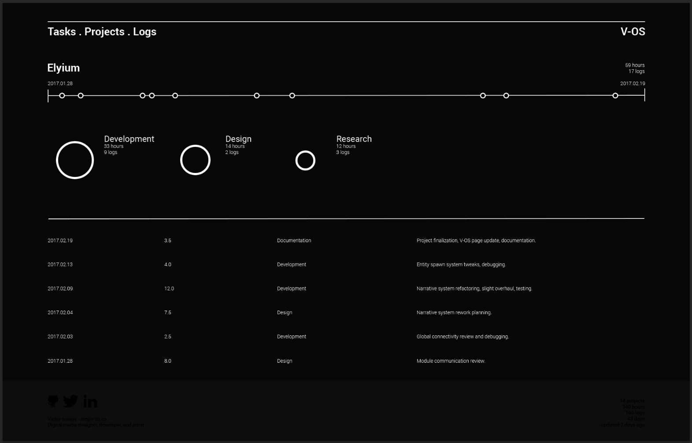

# Log

_Log_ is a logkeeping tool that uses generic text files as a collection of logs, converts them to mySQL entry commands, and visualizes this data through a web-based interface using PHP.

This tool is primarily for my own use, and is designed to parse and showcase my personal data.

The page construction system and its styling is still in progress.

